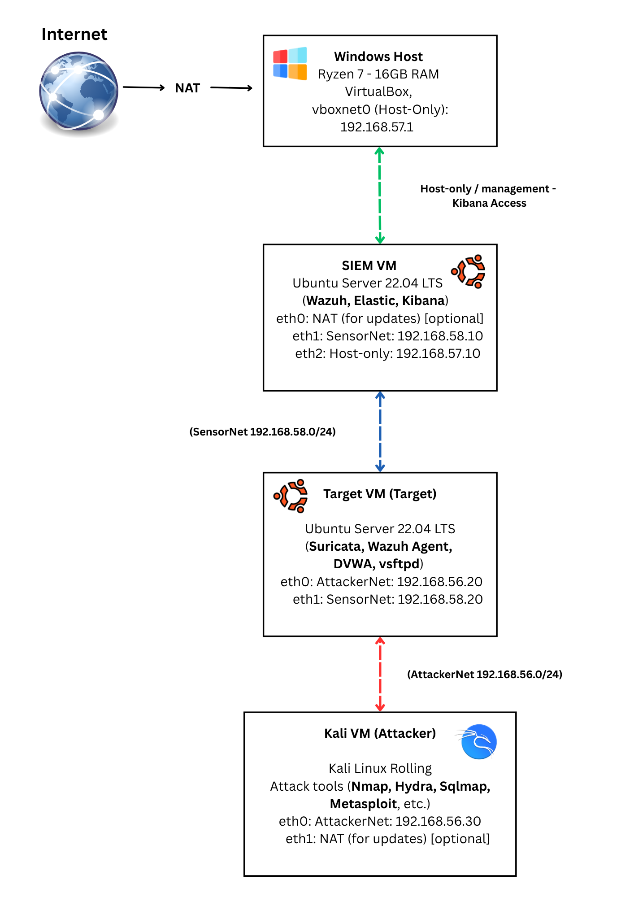

# 00 - Virtual Machine Lab Creation

**Dates:** Sept–Oct 2025  
**Purpose:** This folder documents how I built the **baseline lab environment** used in all subsequent cases (P1–P6).  
It covers VirtualBox setup, network segmentation, OS installs, and design rationale.  

---

## Objective
Build a reproducible lab environment simulating a small SOC setup:  
- **Attacker** (Kali)  
- **Target** (Ubuntu w/ Suricata + Wazuh Agent)  
- **SIEM** (Ubuntu w/ Wazuh Manager + Elastic + Kibana)  

With **segmented networks**:  
- **AttackerNet** -> attacker <-> target only  
- **SensorNet** -> target <-> SIEM (log path)  
- **Host-only** -> analyst host <-> SIEM (Kibana)  

  

---

## Environment
- **Host:** Windows 11 + VirtualBox  
- **Networks:**
  - NAT (updates)
  - Host-only (192.168.57.0/24)
  - SensorNet (192.168.58.0/24)
  - AttackerNet (192.168.56.0/24)  
- **VMs:**
  - Kali Linux (attacker)
  - Ubuntu 22.04 (target, Suricata + Wazuh agent)
  - Ubuntu 22.04 (siem, Wazuh manager + Elastic + Kibana)

---

## Steps
1. **Create networks in VirtualBox**: Host-only, SensorNet, AttackerNet.  
2. **Provision VMs**: import ISOs, install Ubuntu/Kali, assign NICs.  
3. **Apply static IPs** via `netplan` configs.  
4. **Test segmentation**:
   - Kali -> SIEM = ❌ blocked
   - Target -> SIEM = ✅ allowed
   - Host -> SIEM (Kibana) = ✅ allowed  
5. **Save snapshots** after each milestone.

---

## Screenshots
- VirtualBox network manager  
- VM NIC settings (Target, SIEM, Kali)  
- Netplan config snippet  
- Ping tests between networks  

(Place images in `./screenshots/` and embed them here.)

---

## Design Rationale
Separating **AttackerNet** and **SensorNet** ensures the attacker (Kali) cannot directly reach the SIEM.  
Only the Target mediates logs into the SIEM, simulating real-world **east–west vs. management plane separation**.  

---

## Outcome
- Stable 3-VM lab environment created.  
- Segmented networks verified.  
- Baseline ready for P1–P6 SOC detection cases.  

---

## Deep-dive docs
- [Network setup & netplan examples](./network-setup.md)  
- [OS install guides & post-install tasks](./install-guides.md)  

---

**Next:** [P1 - SOC Detection Lab](../01-P1-SOC-Detection-Lab/README.md)

