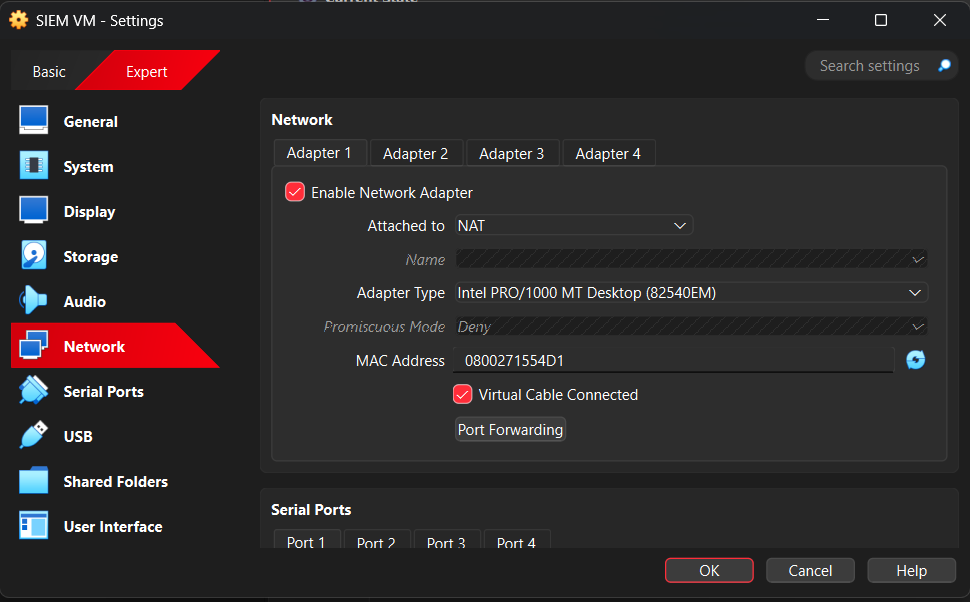
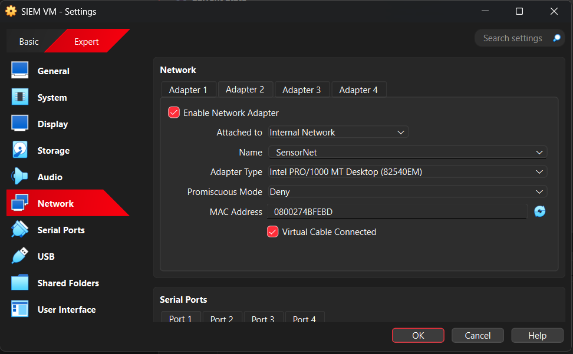
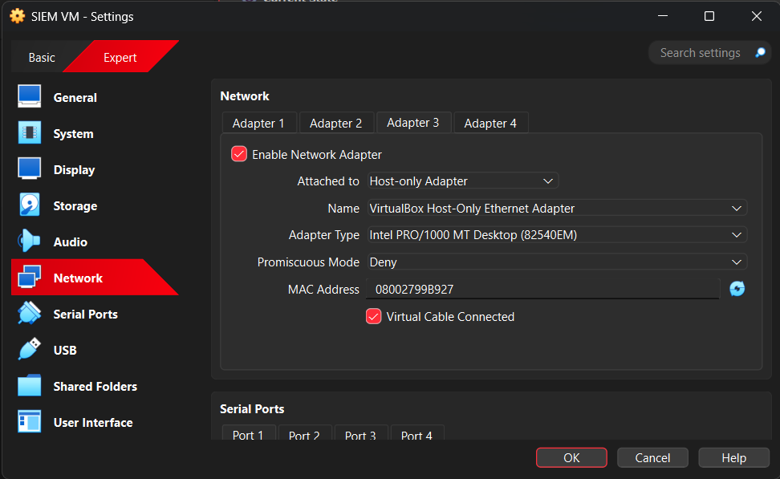
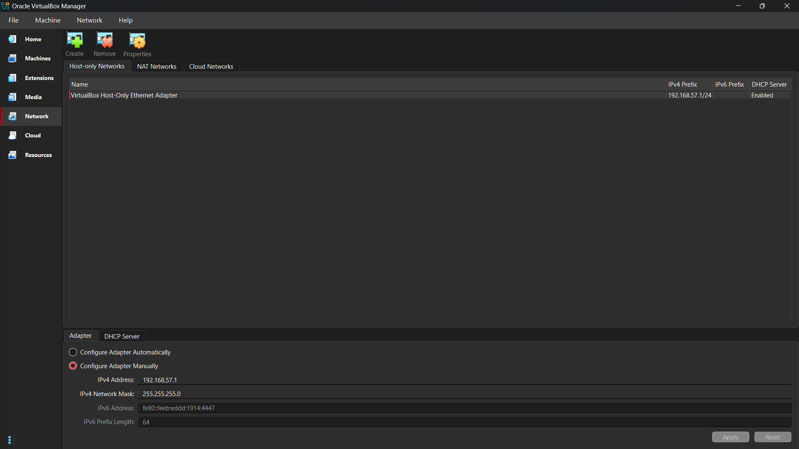
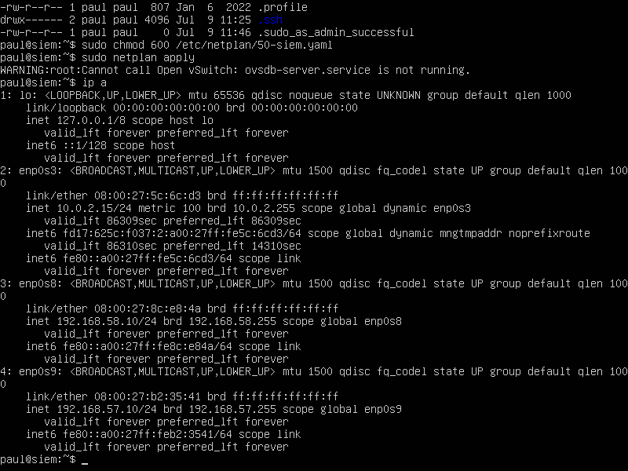
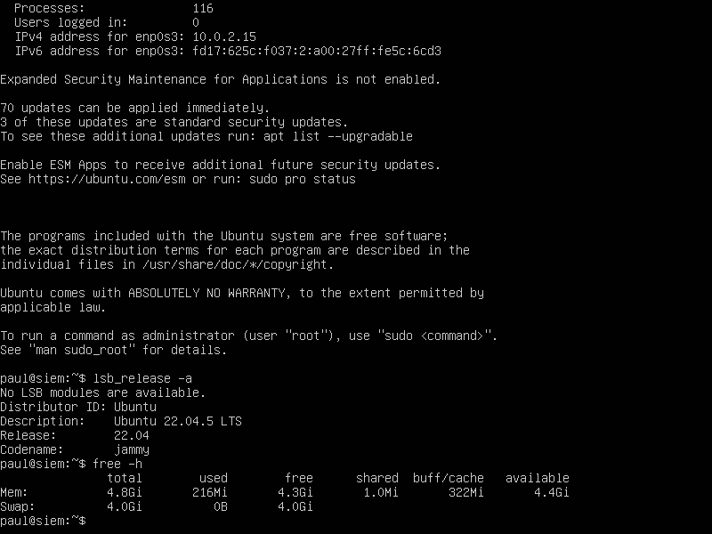
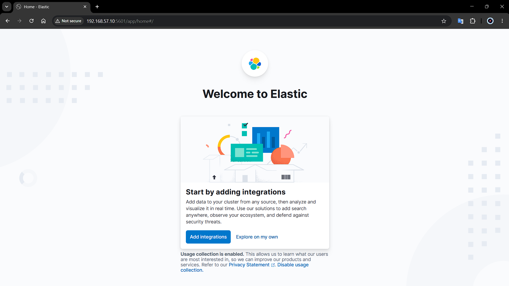

# 00 - Virtual Machine Lab Creation

**Dates:** July 2026

**Purpose:** This folder documents how I built the **baseline lab environment** used in all subsequent cases (P1–P6).  
It covers VirtualBox setup, network segmentation, OS installs, SIEM provisioning, and the technical design rationale. More than just a setup guide, this document serves as a blueprint of the architectural decisions and troubleshooting methodologies applied during the build.

---

## Objective
Build a reproducible lab environment simulating a small SOC setup:  
- **Attacker** (Kali)  
- **Target** (Ubuntu w/ Suricata + Wazuh Agent)  
- **SIEM** (Ubuntu w/ Wazuh Manager + Elastic + Kibana)  

With **segmented networks**:  
- **AttackerNet** = attacker <-> target only  
- **SensorNet** = target <-> SIEM (log path)  
- **Host-only** = analyst host <-> SIEM (Kibana)  

  

---

## Environment & Infrastructure Setup
- **Host:** Windows 11 + VirtualBox  
- **Networks:**
  - NAT (updates)
  - Host-only (192.168.57.0/24)
  - SensorNet (192.168.58.0/24)
  - AttackerNet (192.168.56.0/24)  
- **VMs:**
  - Kali Linux (attacker)
  - Ubuntu 22.04 (target, Suricata + Wazuh agent)
  - Ubuntu 22.04 (siem, Wazuh manager + Elastic + Kibana)
  

**1. Network Topology & OSI Layer Equivalences**

Before installing any software, the network infrastructure had to be clearly defined. In a real-world datacenter, this involves physical cables, switches, and routers. In VirtualBox, these components are simulated via virtual network adapters. To simulate an enterprise-grade, isolated environment, the SIEM VM relies on three distinct interfaces:

- **Adapter 1**: NAT (Updates & External Access)
This acts like a standard home router operating at OSI Layer 3. It provides outbound internet access so the VM can download packages (Elasticsearch, Wazuh, etc.) while blocking inbound external connections to keep the internal lab secure.

  

- **Adapter 2**: Internal Network (SensorNet)
This acts as an isolated physical switch inside a secure server room (OSI Layer 2). SensorNet is intentionally air-gapped where it has no route to the Windows host or the internet. This path is dedicated purely for secure, east-west communication between the Wazuh Agent (Target VM) and the Wazuh Manager (SIEM VM) via TCP ports 1514/1515.

  

- **Adapter 3**: Host-Only Adapter
This functions like a physical cross-over cable plugged directly from the analyst's laptop into the server's management port. This path isolates the Management Plane, allowing access to the Kibana dashboard (Port 5601) directly from the Windows host browser without exposing the SIEM to the broader network.

  

  

   

**2. IP Addressing Strategy: Static vs. DHCP**

In a centralized server architecture, using dynamic IPs (DHCP) for critical infrastructure is a flaw; an IP lease renewal would instantly break agent-manager 
communication. Therefore, Static IPs were hardcoded at the OS kernel level using **netplan**:

- **enp0s3** (NAT) is left on DHCP to receive outbound internet.
- **enp0s8** (SensorNet) is statically set to **192.168.58.10**.
- **enp0s9** (Host-Only) is statically set to **192.168.57.10**.

This configuration guarantees that the Attacker (Kali) cannot directly route traffic to the SIEM, forcing all interactions through the Target VM and accurately mirroring production environment security controls.

  

---

## Phase 1: SIEM Provisioning & Log Pipeline Validation

1. **OS Preparation**: Ubuntu Server 22.04 LTS was provisioned with adequate memory and storage to handle the resource-heavy Elastic stack.

  

2. **Service Installation**: Deployed Wazuh Manager as the detection engine, alongside Elasticsearch (data storage) and Kibana (visualization).

  

  

3. **End-to-End Pipeline Validation:** The logging infrastructure relies on Filebeat to ship raw logs from Wazuh to Elasticsearch.
    to verify its integrity:

 - **Backend Verification**: Called the Elasticsearch API (_cat/indices) via curl to ensure the log index (wazuh-alerts-4.x-*) was actively generating and
   recording document flows (docs count).

  

 - **Frontend Visualization**: Confirmed that backend data was successfully parsed and visually represented via histograms in Kibana Discover, proving the data
   pipeline is 100% operational.

  

**Technical Challenges & Root Cause Analysis**

Building this baseline presented real-world operational incidents that required deep troubleshooting and excellent practice for live incident response:

1. **Storage Depletion (LVM Resizing)**: The initial installation failed when the system directory ran out of space. Expanding the virtual disk in VirtualBox was not enough; the OS required manual repartitioning of the Logical Volume Manager (LVM) via CLI (growpart, pvresize, lvextend, and resize2fs) to recognize and utilize the new disk capacity.

2. **Log Pipeline Blockage (Permission Denied)**: Filebeat initially refused to ship logs, throwing an input disabled error. Investigating via journalctl revealed the OS-level filebeat user lacked read permissions for the Wazuh log directory. Instead of applying an insecure chmod 777 quick-fix, I enforced the Principle of Least Privilege by adding the filebeat user to the wazuh group and setting strict chmod 750 permissions.

3. **Broken Package State**: An interrupted installation script caused the package manager (apt) to show Filebeat as installed, even though its service user was never created in the Linux database. I resolved this state inconsistency by manually creating the user account and executing a --reinstall command on the package to restore dependency integrity.

---
## Next Steps (Work in Progress)

- Phase 2: Target VM Provisioning (Installing Suricata for NIDS and enrolling the Wazuh Agent).

- Phase 3: Attacker VM Setup (Deploying Kali Linux on the AttackerNet).

- Phase 4: Network testing and threat detection simulations (e.g., triggering alerts in the SIEM dashboard).

---

## Design Rationale
Separating **AttackerNet** and **SensorNet** ensures the attacker (Kali) cannot directly reach the SIEM.  
Only the Target mediates logs into the SIEM, simulating real-world **east–west vs. management plane separation** that mirrors a production environment. In this design, all telemetry will be forwarded through authenticated agents from the target VM, creating a realistic simulation of endpoint foothold scenario while allowing to detect and triage threats.

---

## Outcome
- Stable 3-VM lab environment created.  
- Segmented networks verified.  
- Baseline ready for P1–P6 SOC detection cases.  

---

## Deep-dive docs
- [Network setup & netplan examples](./network-setup.md)  
- [OS install guides & post-install tasks](./install-guides.md)  

---

**Next:** [P1 - SOC Detection Lab](../01-P1-SOC-Detection-Lab/README.md)

