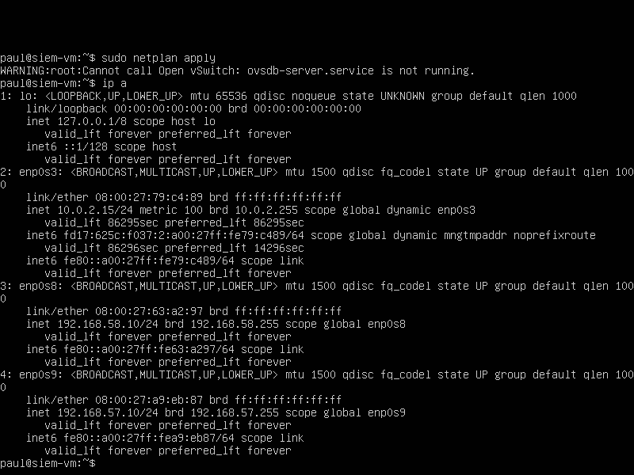
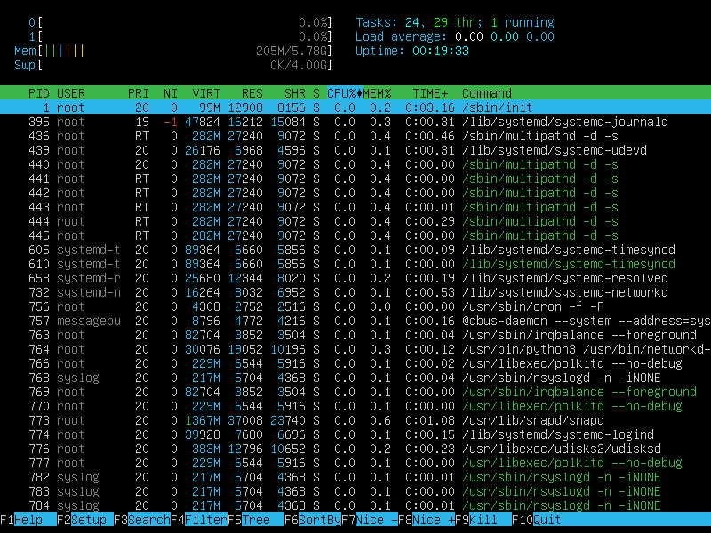
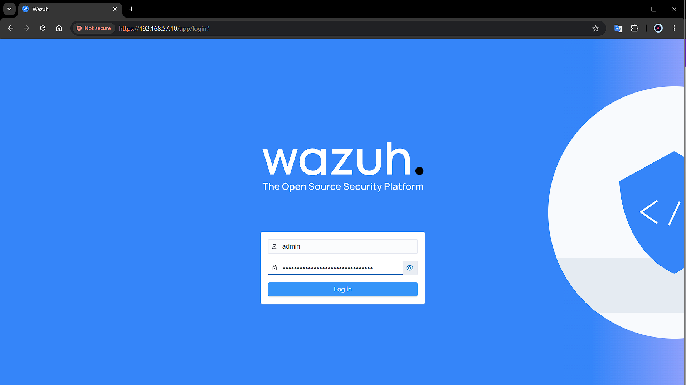
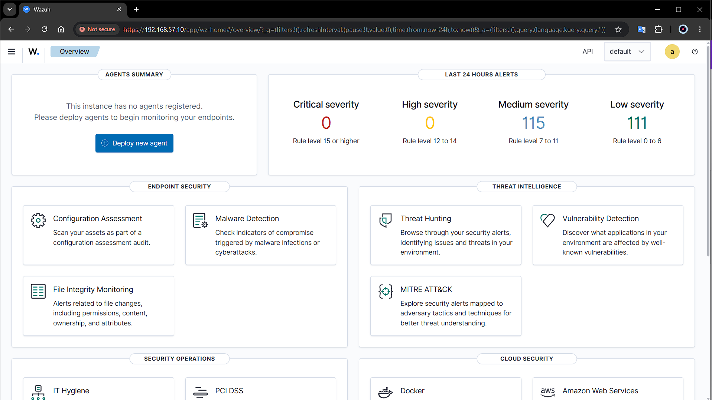
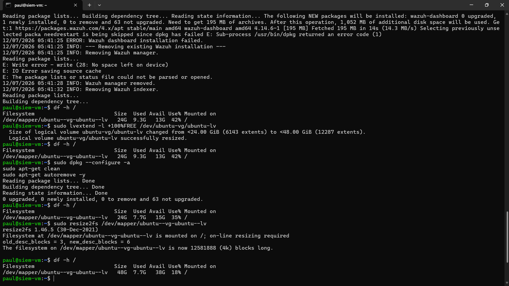
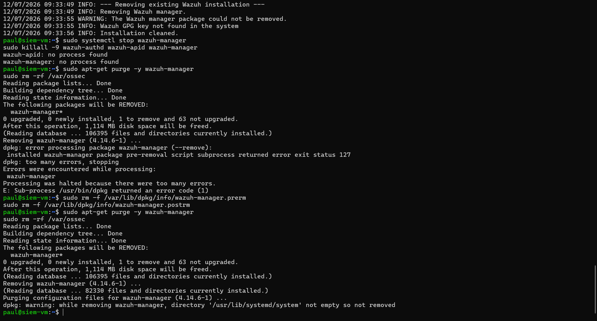
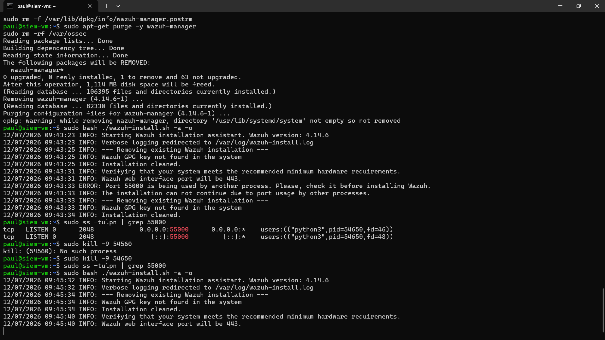

# 00 - Virtual Machine Lab Creation

**Dates:** July 2026

**Purpose:** This folder documents how I built the **baseline lab environment** used in all subsequent cases (P1–P6).  
It covers VirtualBox setup, network segmentation, OS installs, SIEM provisioning, and the technical design rationale. More than just a setup guide, this document serves as a blueprint of the architectural decisions and troubleshooting methodologies applied during the build.

---

## Objective
Build a reproducible lab environment simulating a small SOC setup:  
- **Attacker** (Kali Linux)  
- **Target** (Ubuntu w/ Suricata + Wazuh Agent)  
- **SIEM** (Ubuntu w/ Wazuh Server + Indexer + Dashboard)  

With **segmented networks**:  
- **AttackerNet** = Attacker <-> target only  
- **SensorNet** = Target <-> SIEM (log path)  
- **Host-only** = Analyst host <-> SIEM (UI Dashboard)  

  

---

## Environment & Infrastructure Setup
- **Host:** Windows 11 + VirtualBox  
- **Networks:**
  - NAT (updates)
  - Host-only (192.168.57.0/24)
  - SensorNet (192.168.58.0/24)
  - AttackerNet (192.168.56.0/24)  
- **VMs:**
  - Kali Linux (Attacker)
  - Ubuntu 24.04 (TARGET, Suricata + Wazuh agent)
  - Ubuntu 24.04 (SIEM, Wazuh Server + Indexer + Dashboard)
  

**1. Network Topology & OSI Layer Equivalences**

Before installing any software, the network infrastructure had to be clearly defined. In a real-world datacenter, this involves physical cables, switches, and routers. In VirtualBox, these components are simulated via virtual network adapters. To simulate an enterprise-grade, isolated environment, the SIEM VM relies on three distinct interfaces:

- **Adapter 1**: NAT (Updates & External Access)
This acts like a standard home router operating at OSI Layer 3. It provides outbound internet access so the VM can download packages while blocking inbound external connections to keep the internal lab secure.

  

- **Adapter 2**: Internal Network (SensorNet)
This acts as an isolated physical switch inside a secure server room (OSI Layer 2). SensorNet is intentionally air-gapped where it has no route to the Windows host or the internet. This path is dedicated purely for secure, east-west communication between the Wazuh Agent (Target VM) and the Wazuh Manager (SIEM VM) via TCP ports 1514 & 1515.

  

- **Adapter 3**: Host-Only Adapter
This functions like a physical cross-over cable plugged directly from the analyst's laptop into the server's management port. This path isolates the Management Plane, allowing access to the Wazuh Dashboard (Port 443) directly from the Windows host browser without exposing the SIEM to the broader network.

  

  

   

**2. IP Addressing Strategy: Static vs. DHCP**

In a centralized server architecture, using dynamic IPs (DHCP) for critical infrastructure is a flaw; an IP lease renewal would instantly break agent-manager communication. Therefore, Static IPs were hardcoded at the OS kernel level using **netplan**:

- **enp0s3** (NAT) is left on DHCP to receive outbound internet.
- **enp0s8** (SensorNet) is statically set to **192.168.58.10**.
- **enp0s9** (Host-Only) is statically set to **192.168.57.10**.

This configuration guarantees that the Attacker (Kali) cannot directly route traffic to the SIEM, forcing all interactions through the Target VM and accurately mirroring production environment security controls.

  

---

## Phase 1: SIEM Provisioning & Log Pipeline Validation

### The SIEM Core: Architecture & Installation Flow

To build a robust, enterprise-grade SIEM without the massive licensing costs, this lab leverages the modern **Wazuh unified platform**. Evolving from its reliance on the traditional ELK Stack, Wazuh now operates on a streamlined, self-contained architecture (based on OpenSearch) to eliminate compatibility issues and optimize performance for security operations.

Understanding the components is critical:

1. **Wazuh Indexer (The Data Layer)**: This is the core database and search engine. It provides the storage and indexing infrastructure, designed to handle massive volumes of raw log data and execute lightning-fast queries.

2. **Wazuh Server (The Analytical Brain)**: The central engine that collects logs from endpoint agents, analyzes them in real-time, performs file integrity monitoring (FIM), and triggers alerts based on security rules. It securely writes these alerts directly to the Indexer.

3. **Wazuh Dashboard (The Presentation Layer)**: The web interface. It connects to the Data Layer to provide visual dashboards, search interfaces, and unified agent management for the security analyst.

### Deployment & Validation Steps

1. **OS Preparation**: Ubuntu Server 24.04 LTS was provisioned with adequate memory and storage to handle the SIEM components.

  

2. **Service Installation**: Deployed the complete Wazuh stack (Indexer, Server, and Dashboard) via the automated provisioning script to ensure correct cryptographic certificate generation between the nodes.

  

3. **End-to-End Pipeline Validation:** Validated the management plane by accessing the Wazuh Dashboard from the Windows host via the Host-only network (`https://192.168.57.10`). Confirmed the backend services were successfully linked and the UI was fully operational.

  

  

**Technical Challenges & Root Cause Analysis**

Building this baseline presented real-world operational incidents that required deep troubleshooting and excellent practice for live incident response:

1. **Storage Depletion (LVM Resizing)**: During the Wazuh Dashboard provisioning, the installation abruptly failed and triggered an automated rollback with an `E: Write error - write (28: No space left on device)` error. Root cause analysis revealed that despite provisioning a 50GB virtual disk in VirtualBox, the Ubuntu 24.04 installer defaults to allocating only ~50% of the storage to the root Logical Volume (LV), leaving the rest unallocated. 
To resolve this without destroying the VM, I performed manual LVM resizing via CLI. I expanded the logical volume to utilize 100% of the available free space (`sudo lvextend -l +100%FREE /dev/ubuntu-vg/ubuntu-lv`), and subsequently resized the filesystem to recognize the new capacity (`sudo resize2fs /dev/mapper/ubuntu--vg-ubuntu--lv`). After repairing the locked package manager state (`sudo dpkg --configure -a` and `apt-get clean`), the deployment proceeded successfully.

  

2. **Broken Package State & Port Collisions (dpkg Error 127)**: The storage depletion during the initial run caused the Wazuh installer to crash mid-execution. This left orphaned "zombie" processes running in the background, which locked critical TCP ports (1515 and 55000) and prevented reinstallation. Furthermore, the package manager (`dpkg`) was locked in a broken state; standard removal commands failed with a `pre-removal script subprocess returned error exit status 127` because the uninstaller script itself was partially overwritten or corrupted during the disk space exhaustion. 
To resolve this "dpkg loop of death", I performed a hard manual cleanup. I bypassed the package manager by manually deleting the corrupted control files (`rm -f /var/lib/dpkg/info/wazuh-manager.prerm*`), terminated the zombie processes (`killall -9`), and executed a forced package purge (`apt-get purge -y wazuh-manager`). After deleting the residual `/var/ossec` directory, the system was completely sterilized for a clean deployment using the `-o` (overwrite) flag.

  

3. **Lingering API Processes & Port Exhaustion (PID Hunting)**: Despite removing the broken packages and terminating the primary Wazuh manager services, the automated re-installation failed again because TCP port 55000 was still actively bound. The Wazuh API service runs under a generic `python3` process, which allowed it to evade standard `killall` commands that were only targeting Wazuh-specific names. To resolve this, I utilized socket statistics (`ss -tulpn | grep 55000`) to isolate the exact Process ID (PID) holding the network interface hostage. After identifying the rogue `python3` process (PID: 54650), I issued a targeted `SIGKILL` (`kill -9 54650`). Subsequent verification confirmed the port was completely cleared, enabling the Wazuh installation script to bind successfully to its required ports and finalize the deployment.

  

---
## Next Steps (Work in Progress)

- Phase 2: Target VM Provisioning (Installing Suricata for NIDS and enrolling the Wazuh Agent via Dashboard UI).

- Phase 3: Attacker VM Setup (Deploying Kali Linux on the AttackerNet).

- Phase 4: Network testing and threat detection simulations (e.g., triggering alerts in the SIEM dashboard).

---

## Design Rationale
Separating **AttackerNet** and **SensorNet** ensures the attacker (Kali) cannot directly reach the SIEM.  
Only the Target mediates logs into the SIEM, simulating real-world **east–west vs. management plane separation** that mirrors a production environment. In this design, all telemetry will be forwarded through authenticated agents from the target VM, creating a realistic simulation of endpoint foothold scenario while allowing to detect and triage threats.

---

## Outcome
- Stable 3-VM lab environment created.  
- Segmented networks verified.  
- Baseline ready for P1–P6 SOC detection cases.  

---

## Deep-dive docs
- [Network setup & netplan examples](./network-setup.md)  
- [OS install guides & post-install tasks](./install-guides.md)  

---

**Next:** [P1 - SOC Detection Lab](../01-P1-SOC-Detection-Lab/README.md)
