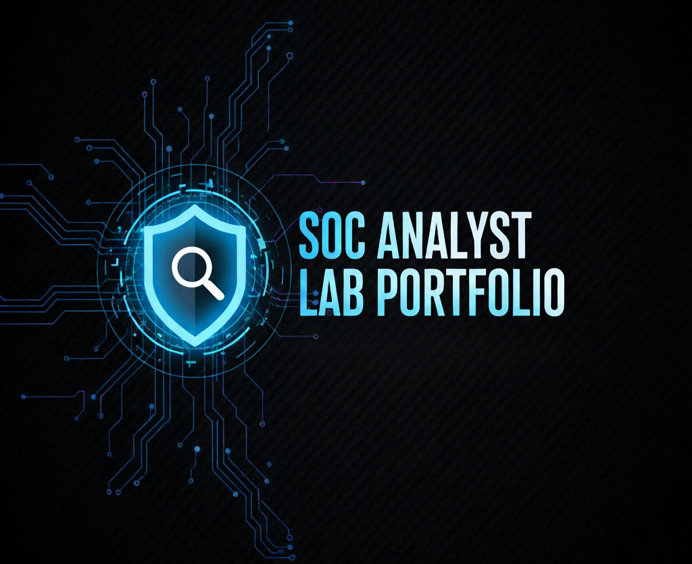

  

  
  
  
  
  

# Cybersecurity Case Files
Welcome to my **SOC Analyst Lab Portfolio** - My collection of hands-on labs (P1-P6), Python tools I built for analysis, and job simulations completed on **Forage** while training for CompTIA CySA+ and SOC workflows.

---

## Case Index
- [P1 - SOC Detection Lab (Suricata + Wazuh + ELK Stack)](./01-P1-SOC-Detection-Lab/README.md)
- [P2 - PCAP: DNS Exfiltration Deep Dive](./02-P2-PCAP-DNSExfil/README.md)
- [P3 - Cloud: S3 Public Access Misconfiguration](./03-P3-CloudS3/README.md)
- [P4 - Endpoint IR: Windows Triage & Playbook](./04-P4-EndpointIR/README.md)
- [P5 - GRC Mini Pack: BIA + Tabletop](./05-P5-GRC/README.md)
- [P6 - Add-ons: Honeypot & Correlation](./06-P6-Honeypot/README.md)

---
## Lab Docs
- [Daily Schedule](./docs/schedule.md)
- [Lab Topology (Option A = Scenario 2)](./docs/topology.md)
- [OSI Layer Mapping (Option A)](./docs/osi-mapping.md)
- [Connectivity Verification Checklist](./docs/verification.md)

---

## Python Projects
Practical **mini Python tools** created to support SOC workflows - parsing logs, enriching IOCs, generating SIEM summaries, and automating triage tasks.  
Each script has its own doc (Objective -> Usage -> Output -> Notes) with sample runs and screenshots.  
- [Python Project Index](./07-Python-Projects/README.md)
  
---
## Forage Projects
These are structured virtual experience projects from **Forage**, simulating real-world SOC and cybersecurity analyst tasks:

- [Commonwealth Bank Introduction to Cybersecurity](./Forage-Projects/Commonwealth-Bank/README.md)
- [AIG Shileds Up: Cybersecurity](./Forage-Projects/AIG-shields-up/README.md)
- [Telstra Cybersecurity](./Forage-Projects/Telstra/README.md)
